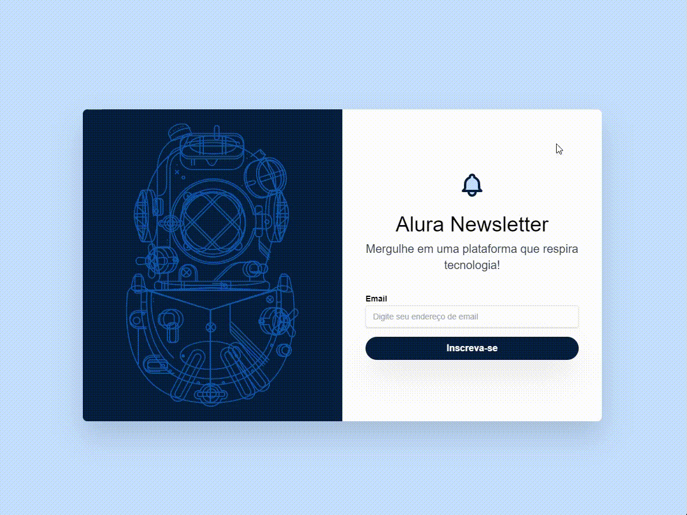

# Projeto realizado com Tailwind CSS

## A ativade consistia na criação de um Newsletter ultilizando varias fucionalidades do Tailwind, desde o posicionamento com flexbox, estilizações e animações.

### Para telas menores

